# ARGUS — Autonomous Reasoning Gateway for Unified Systems

An AIOps agent that detects, investigates, and remediates production incidents the way an on-call SRE would, but in seconds. A watcher service polls Prometheus, opens an incident for every firing alert, and starts an investigation on its own. The agent pulls live metrics and pod logs, checks deployment history and git commits, diagnoses the root cause, and proposes a fix. **Nothing executes without explicit human approval.** After an approved fix, ARGUS verifies recovery, closes the incident, and writes a post-incident report.

Built with the Anthropic Claude API (tool-use agent loop) on Azure AI Foundry, Prometheus, Fluent Bit, Kubernetes, Streamlit, and Splunk (optional).

**Contents:** [Quick start](#quick-start) · [Architecture](#architecture) · [How it works](#how-it-works) · [Detailed activity diagrams](#detailed-activity-diagrams) · [Status reference](#incident-status-reference) · [Failure handling](#failure-handling) · [Configuration](#configuration) · [Setup](#setup) · [Project layout](#project-layout) · [Known limitations](#known-limitations) · [Roadmap](#roadmap)

---

## Quick start

```bash
scripts/start_argus.sh      # starts the watcher (detection + investigation) and the dashboard
open http://localhost:8501
scripts/rearm_demo.sh       # demo only: redeploys payment-service and leaks memory so an alert fires
```

Within about 90 seconds the alert fires, ARGUS opens an incident (`INC0001xxx`), emails you, investigates on its own, and asks for approval in the dashboard and by email.

---

## Architecture

### Telemetry and cluster

```
┌─────────────────────────────────────────────────────────────────┐
│                    kind Kubernetes Cluster                       │
│                                                                  │
│  ┌──────────────────┐      ┌────────────────────────────────┐   │
│  │  default namespace│      │      monitoring namespace      │   │
│  │                  │      │                                │   │
│  │ ┌──────────────┐ │      │ ┌────────────┐ ┌───────────┐  │   │
│  │ │payment-service│◄├──────┤─│ Prometheus  │ │  Grafana  │  │   │
│  │ │   :8080       │ │scrape│ │            │ │  :3000    │  │   │
│  │ │  /metrics     │ │      │ └─────┬──────┘ └───────────┘  │   │
│  │ │  /health      │ │      │       │ evaluates              │   │
│  │ │  /leak        │ │      │ ┌─────▼──────────────────────┐│   │
│  │ └──────┬────────┘ │      │ │   PrometheusRule CRD        ││   │
│  │        │ stdout   │      │ │ PaymentServiceHighMemory    ││   │
│  │        │ logs     │      │ │ PaymentServicePodRestarted  ││   │
│  └────────┼──────────┘      │ │ PaymentServiceHighErrors    ││   │
│           │                 │ │ PaymentServiceHighLatency   ││   │
│  ┌────────▼──────────┐      │ └────────────────────────────┘│   │
│  │    Fluent Bit     │      └────────────────────────────────┘   │
│  │   (DaemonSet)     │                                           │
│  │ tails             │                                           │
│  │ /var/log/         │                                           │
│  │ containers/*.log  │                                           │
│  └────────┬──────────┘                                          │
└───────────┼─────────────────────────────────────────────────────┘
            │ HTTPS/HEC :8088               HTTP :9090
            ▼                               ▼
    ┌──────────────┐               ┌─────────────────┐
    │    Splunk    │               │   Prometheus    │
    │  (optional)  │               │  /api/v1/alerts │
    │  REST :8089  │               │  /api/v1/query  │
    └──────┬───────┘               └────────┬────────┘
           │                                │
           └───────────────┬────────────────┘
                           ▼
                  ARGUS agent tools (see below)
```

### ARGUS components

Two processes cooperate through three small files. The **watcher** owns detection and runs every investigation. The **dashboard** is a thin view: it reads state and records operator decisions. Closing, refreshing, or restarting the dashboard never affects a run.

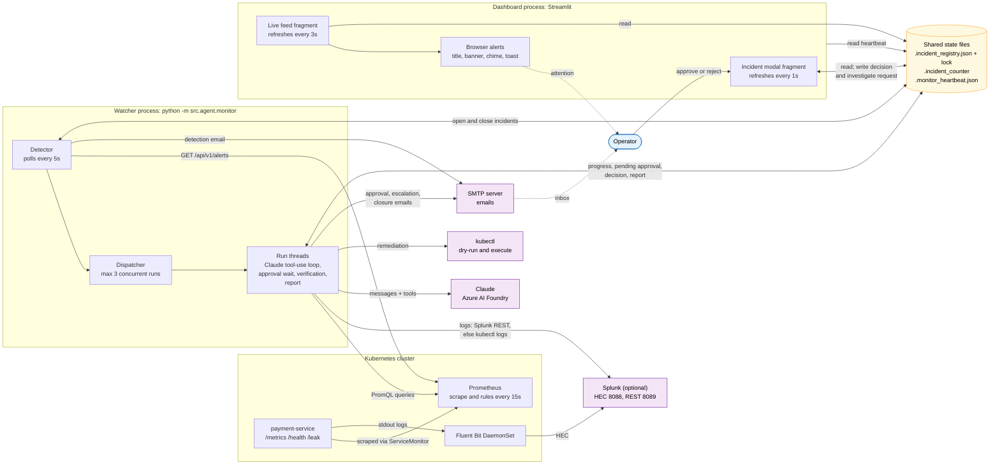

### Agent tools

| Tool | Kind | Live source | Offline fallback |
|---|---|---|---|
| `get_alert` | read | Prometheus `/api/v1/alerts` (firing, `service=payment-service`) | `alert.txt` |
| `get_metrics` | read | Prometheus `/api/v1/query` (memory, cache, restarts, 5xx rate, p99), restricted to pods that exist now | `metrics.txt` |
| `get_logs` | read | Splunk REST, else `kubectl logs --tail=50` | `logs.txt` |
| `get_deploy_history` | read | recorded fixture | `deploy_history.json` |
| `get_git_log` | read | recorded fixture | `git_log.txt` |
| `restart_pod` | **write, approval required** | `kubectl rollout restart` + `rollout status` | none |
| `rollback_deployment` | **write, approval required** | `kubectl rollout undo` + `rollout status` | none |
| `scale_deployment` | **write, approval required** | `kubectl scale` | none |

---

## How it works

1. **Detect.** The watcher polls Prometheus every 5s. A new firing alert for a monitored service becomes an incident with a sequential number and a "DETECTED" email.
2. **Dispatch.** With auto-investigate on (default), the incident is claimed and a run thread starts immediately. Operators can also request an investigation from the dashboard.
3. **Investigate.** Claude runs a tool-use loop: it chooses which read tools to call, in what order, then writes a structured diagnosis (Root Cause, Evidence, Recommended Action, Confidence) and calls a remediation tool.
4. **Approve.** The remediation call is intercepted by the approval gate. ARGUS records a dry-run, emails "APPROVAL NEEDED", and waits (default 15 minutes) for an operator decision in the dashboard. Rejected or expired requests execute nothing and escalate by email.
5. **Execute.** An approved action runs through `kubectl`.
6. **Verify.** ARGUS polls Prometheus until the alert stays clear on two consecutive checks, or gives up after 150s.
7. **Report and close.** ARGUS writes a post-incident report (timeline, outcome, follow-ups), sets the final status, and sends the closure email.

The next section shows every step, branch, and failure path.

---

## Detailed activity diagrams

Diagram index:
[Master flow](#a-master-flow) ·
[1. Detection](#1-detection-the-watcher-poll-tick) ·
[2. Dispatch](#2-dispatch-who-gets-an-investigation) ·
[3. Investigation](#3-investigation-the-agent-loop) ·
[4. Approval](#4-approval-gate) ·
[5. Execution](#5-execution) ·
[6. Verification](#6-verification-and-outcome) ·
[7. Report and closure](#7-post-incident-report-and-closure) ·
[Sequence](#b-end-to-end-sequence) ·
[Approval handshake](#c-approval-handshake-between-processes) ·
[State machine](#d-incident-state-machine) ·
[Browser alerts](#e-browser-attention-alerts)

### A. Master flow

Every incident ends in exactly one of the colored outcomes. Boxes are expanded in the numbered diagrams below.

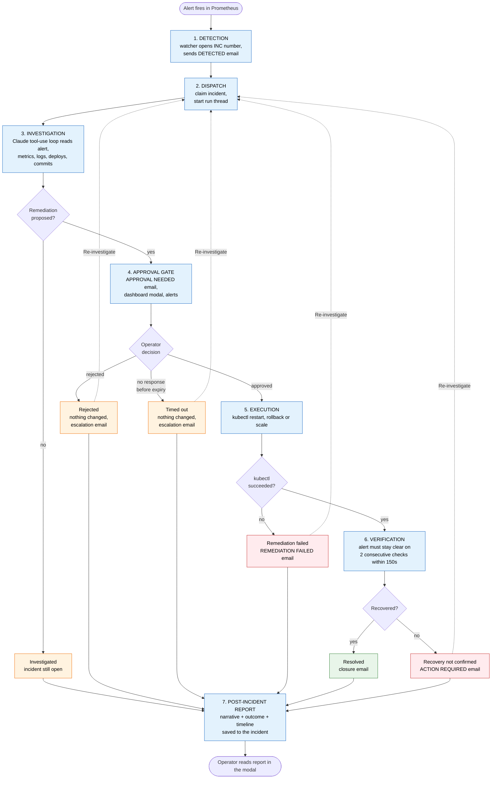

### 1. Detection: the watcher poll tick

Runs every `ARGUS_POLL_SECS` (5s). The watcher is independent of any browser, so incidents are opened even if nobody is looking at the dashboard.

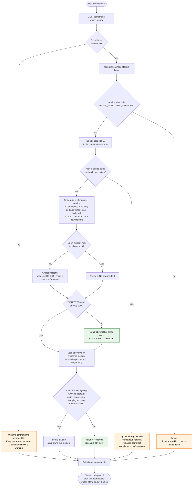

### 2. Dispatch: who gets an investigation

Runs right after detection on every tick. A run starts for new incidents (auto mode) and for operator requests.

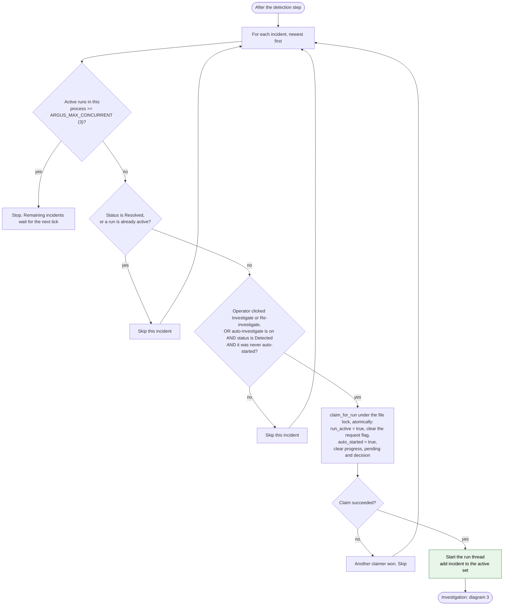

Auto-mode only fires once per incident (`auto_started`), so an incident that was rejected or timed out is never silently re-run. Use **Re-investigate** for that.

### 3. Investigation: the agent loop

The model decides which tools to call and in what order. The code only executes the requested tool and returns the result.

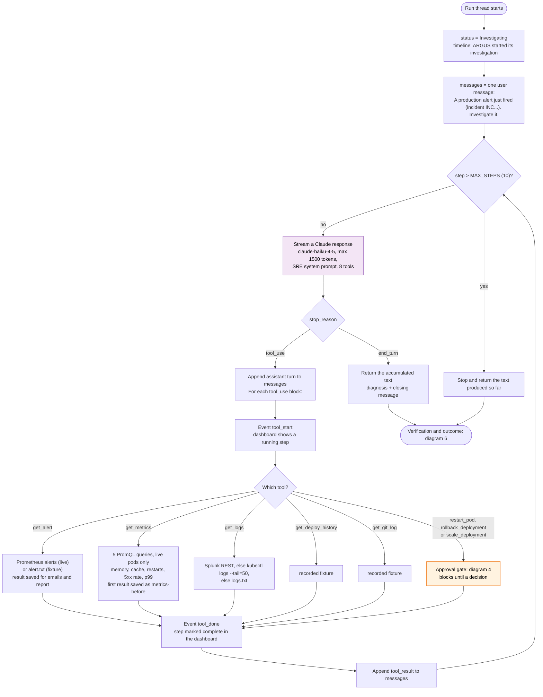

The system prompt tells the model to investigate first, write the diagnosis in a fixed structure, then call the right remediation tool. The model's closing message after a rejected or expired action is not used as the report: the report is rebuilt from recorded facts (diagram 7).

### 4. Approval gate

Entered when the model calls a write tool. Nothing executes until a human approves.

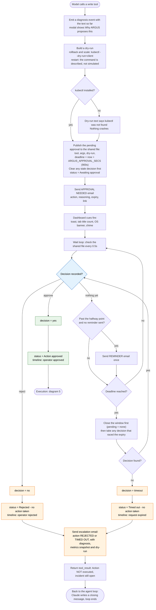

### 5. Execution

Only reachable after an explicit approval.

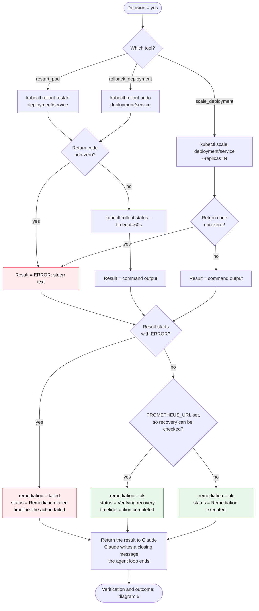

### 6. Verification and outcome

After the agent loop ends, ARGUS decides the outcome. For an approved, successful fix it verifies recovery before closing anything.

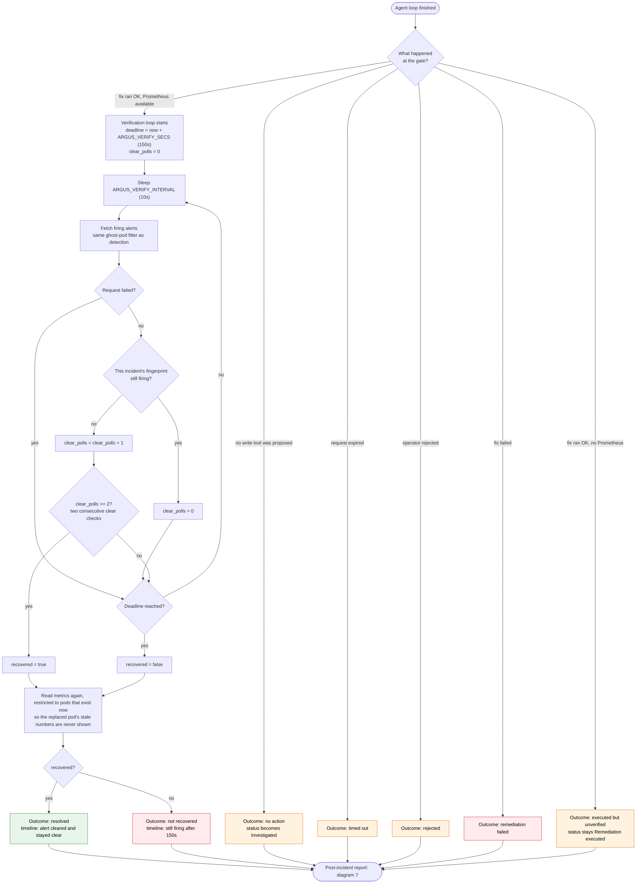

A flaky Prometheus request is retried and does not count as either clear or firing, so a transient error can never close an incident.

### 7. Post-incident report and closure

The report is assembled from recorded facts, not from the model's chat. The model writes only the narrative; the Outcome and Timeline are generated in code so their tense and content are correct by construction.

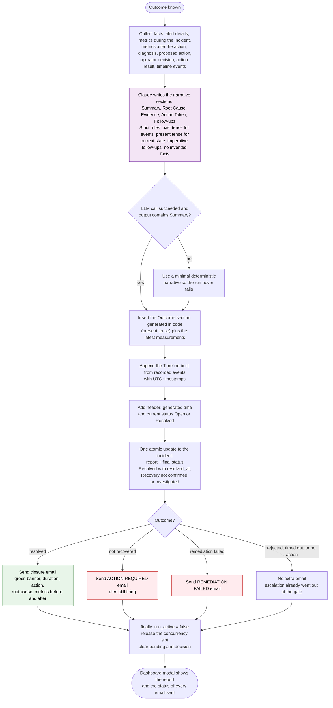

### B. End-to-end sequence

One incident from alert to closure, showing which component does what. The alternatives show the rejected and expired paths.

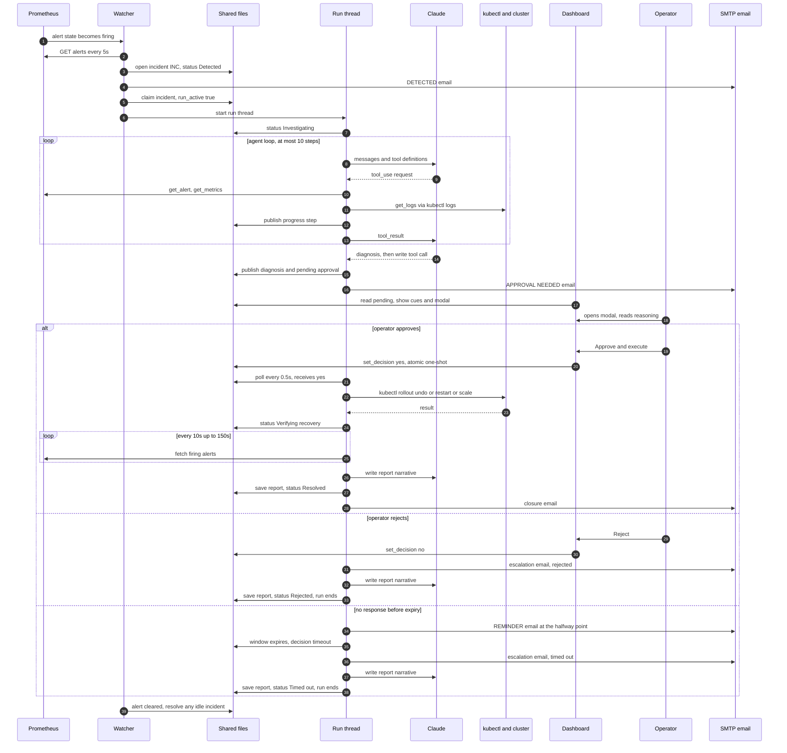

### C. Approval handshake between processes

The watcher and the dashboard are separate processes. They coordinate through one file protected by an OS file lock, so every step below is atomic and a stale or duplicate click can never approve the wrong action.

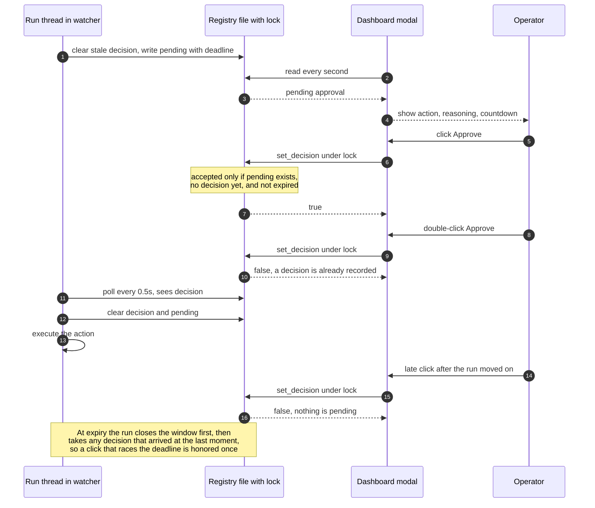

### D. Incident state machine

The status shown in the dashboard. Statuses with a run attached are protected from auto-resolution by the watcher.

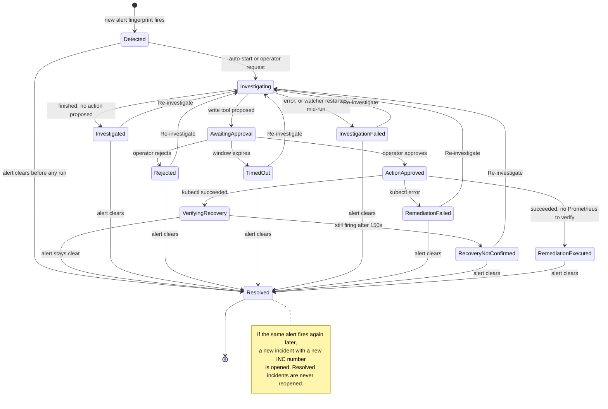

### E. Browser attention alerts

How the dashboard gets a student's attention, without annoying them. Runs inside the live feed, which refreshes every 3 seconds.

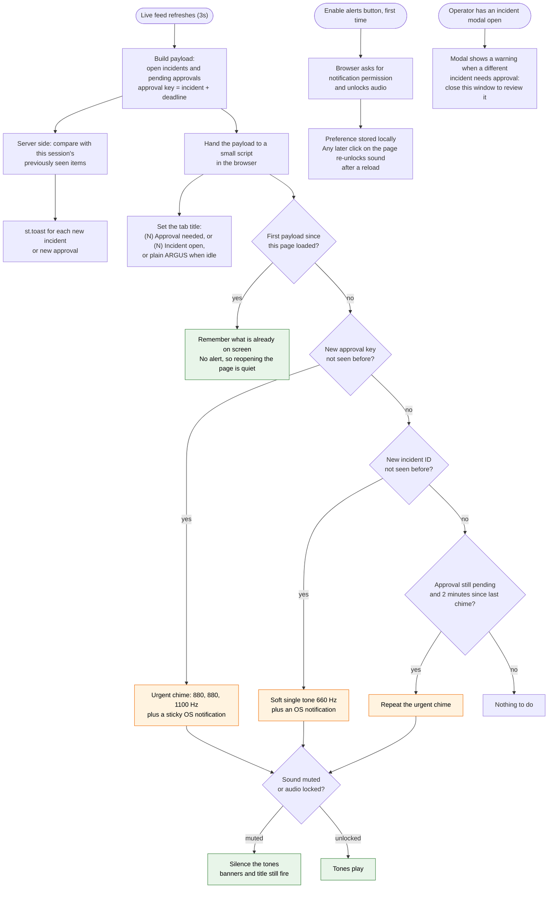

---

## Incident status reference

| Status | Meaning | Who set it | Terminal? |
|---|---|---|---|
| Detected | Alert is firing, no run yet | watcher | no |
| Investigating | Run thread is active | run thread | no |
| Awaiting approval | A fix is proposed and waiting for a decision | run thread | no |
| Action approved | Operator approved, command executing | run thread | no |
| Verifying recovery | Fix applied, confirming the alert stays clear | run thread | no |
| Resolved | Alert cleared and stayed clear (or cleared on its own) | run thread or watcher | **yes** |
| Remediation executed | Fix applied but recovery could not be checked (no Prometheus) | run thread | no |
| Investigated | Finished without proposing an action | run thread | no |
| Rejected - no action taken | Operator rejected the fix | run thread | no |
| Timed out - no action taken | No decision before the window expired | run thread | no |
| Remediation failed | The approved kubectl command failed | run thread | no |
| Recovery not confirmed | Fix applied but the alert was still firing after 150s | run thread | no |
| Investigation failed | Error in the run, or the watcher restarted mid-run | run thread or watcher | no |

Every non-terminal status other than the four in-flight ones (Investigating, Awaiting approval, Action approved, Verifying recovery) can be re-investigated, and moves to Resolved on its own if the alert stops firing.

### Emails sent

| Email | When | Contents |
|---|---|---|
| DETECTED | Once, when the incident is opened | alert, service, severity, firing since, link |
| APPROVAL NEEDED | When a fix needs a decision | action in plain English, root cause, expiry time, link |
| REMINDER | Once, at the halfway point of the wait | same as above |
| Escalation (REJECTED or TIMED OUT) | At the gate, when nothing executes | diagnosis, metrics snapshot, dry-run |
| RESOLVED | After verified recovery | summary, duration, action, root cause, metrics before and after |
| ACTION REQUIRED | Fix ran but the alert is still firing | same layout, red banner |
| REMEDIATION FAILED | The approved command failed | same layout, red banner |

---

## Failure handling

| What goes wrong | What ARGUS does |
|---|---|
| Prometheus unreachable | Watcher records the error in its heartbeat and keeps last known incidents. Dashboard shows a warning. Nothing is closed. |
| Watcher is down | Dashboard shows a red banner when the heartbeat is older than 15s. No new alerts are detected or investigated. |
| Watcher restarts mid-run | At startup, in-flight incidents become "Investigation failed" with an explanatory report. Re-investigate to retry. |
| Dashboard closed, refreshed, or restarted | No effect. The dashboard owns no run state. |
| Claude API error during a run | Incident becomes "Investigation failed" with the error text. |
| Report model call fails | A minimal deterministic report is used. The run still completes. |
| SMTP unavailable | The email step records `email failed: reason` and carries on. It never raises. |
| `kubectl` missing or failing | The dry-run text says so. A failing approved command becomes "Remediation failed" and sends an email. |
| Operator never responds | Reminder at the halfway point, then the request expires. Nothing executes. Escalation email goes out. |
| Double click, stale click, click after expiry | Refused. Decisions are one-shot and expiry-checked under a file lock. |
| Replaced pod keeps firing an alert | Alerts tied to pods that no longer exist are ignored, so they can neither hold an incident open nor create a duplicate. |
| Verification request fails | Retried, and counted as neither clear nor firing. |
| More than 3 incidents at once | Three run concurrently. The rest wait for a free slot. |

---

## Configuration

| Variable | Default | Purpose |
|---|---|---|
| `ANTHROPIC_FOUNDRY_BASE_URL`, `ANTHROPIC_FOUNDRY_API_KEY` | none | Claude via Azure AI Foundry |
| `PROMETHEUS_URL` | none | Enables live mode. Without it, tools read recorded fixtures. |
| `SPLUNK_URL`, `SPLUNK_USER`, `SPLUNK_PASSWORD` | none | Live log source. If unset, see `KUBECTL_LOGS_TARGET`. |
| `KUBECTL_LOGS_TARGET` | none | e.g. `deployment/payment-service`. Reads logs with `kubectl logs` when Splunk is not used. |
| `ARGUS_MONITORED_SERVICES` | `payment-service` | Comma-separated services whose alerts become incidents |
| `ARGUS_POLL_SECS` | `5` | Watcher poll interval |
| `ARGUS_AUTO_INVESTIGATE` | `1` | `0` disables auto-start, so an operator clicks Investigate |
| `ARGUS_APPROVAL_SECS` | `900` | How long an approval request waits before it expires |
| `ARGUS_VERIFY_SECS` | `150` | Verification window after an approved fix |
| `ARGUS_VERIFY_INTERVAL` | `10` | Seconds between verification checks |
| `ARGUS_MAX_CONCURRENT` | `3` | Parallel investigations |
| `ARGUS_DASHBOARD_URL` | `http://localhost:8501` | Link used in emails |
| `SMTP_HOST`, `SMTP_PORT`, `SMTP_USER`, `SMTP_PASSWORD` | none | Email transport (STARTTLS on 587, SSL on 465) |
| `ALERT_EMAIL_TO`, `ALERT_EMAIL_FROM` | none | Recipient and sender |
| `SMTP_STARTTLS` | `1` | `0` for plain local test servers |

---

## Telemetry pipeline

### Logs
```
payment-service stdout
  → Fluent Bit DaemonSet tails /var/log/containers/
  → ships to Splunk HEC (HTTPS port 8088)
  → get_logs() queries Splunk REST API (port 8089)
  → ARGUS reads last 50 log lines
```
Without Splunk, `get_logs()` falls back to `kubectl logs --tail=50` when `KUBECTL_LOGS_TARGET` is set.

### Metrics
```
payment-service /metrics endpoint
  → Prometheus scrapes every 15s via ServiceMonitor
  → get_metrics() queries /api/v1/query (5 PromQL expressions)
  → ARGUS reads memory, cache, restarts, error rate, p99 latency
```

### Alerts
```
Prometheus evaluates PrometheusRule every 15s
  → alert state: inactive → pending → firing
  → the watcher reads /api/v1/alerts and opens an incident per firing alert
```

---

## Setup

### Prerequisites
- Docker (Docker Desktop, or Colima on macOS)
- `kind`, `kubectl`, `helm` installed
- Python 3.9+
- Azure AI Foundry access (or swap for direct Anthropic API)

### 1. Clone and install

```bash
git clone https://github.com/katkhedepushpak/argus.git
cd argus
python -m venv .venv
source .venv/bin/activate      # macOS/Linux
# .venv\Scripts\activate       # Windows
pip install -r requirements.txt
cp .env.example .env           # fill in credentials
```

### 2. Create the kind cluster

```bash
kind create cluster --name argus
```

### 3. Install Prometheus stack

```bash
helm repo add prometheus-community https://prometheus-community.github.io/helm-charts
helm repo update
helm install prometheus prometheus-community/kube-prometheus-stack \
  -n monitoring --create-namespace
```

### 4. Build and deploy payment-service

```bash
docker build -t payment-service:2.4.0 k8s/payment-service/
kind load docker-image payment-service:2.4.0 --name argus
kubectl apply -f k8s/payment-service/manifests.yaml
kubectl apply -f k8s/payment-service-alerts.yaml
```

To make `rollback_deployment` meaningful, deploy an earlier revision first (for example, apply the manifest once with a `2.3.1` tag, then apply `2.4.0`), so the Deployment has a previous revision to return to.

### 5. Install Fluent Bit

```bash
helm repo add fluent https://fluent.github.io/helm-charts
helm install fluent-bit fluent/fluent-bit \
  -n logging --create-namespace \
  -f k8s/fluent-bit-values.yaml
```

### 6. Log source: Splunk or kubectl logs

```bash
docker run -d --name splunk \
  --memory=1500m --memory-swap=1500m \
  -p 8000:8000 -p 8088:8088 -p 8089:8089 \
  -e SPLUNK_START_ARGS=--accept-license \
  -e SPLUNK_PASSWORD=<your-password> \
  -e SPLUNK_HEC_TOKEN=<your-hec-token> \
  splunk/splunk:latest
```

The Splunk image is x86-only and does not start reliably under emulation on Apple Silicon. In that case skip Splunk and set `KUBECTL_LOGS_TARGET=deployment/payment-service` instead.

### 7. Expose services locally

```bash
kubectl port-forward svc/payment-service 8080:8080 -n default &
kubectl port-forward svc/prometheus-kube-prometheus-prometheus 9090:9090 -n monitoring &
```

A `kubectl port-forward` to a Service is bound to one pod. After a rollout, restart it (`scripts/rearm_demo.sh` does this for the payment-service).

---

## Run ARGUS

```bash
scripts/start_argus.sh
```

This starts the **watcher** (`python -m src.agent.monitor`) and the **dashboard** (`streamlit run dashboard.py`) together and sets live-mode defaults (`PROMETHEUS_URL`, `KUBECTL_LOGS_TARGET`). Open http://localhost:8501. If the watcher is not running, the dashboard says so with a red banner.

### Inject a fault to test

```bash
scripts/rearm_demo.sh
```

It redeploys payment-service, restarts its port-forward, and leaks about 230,000 cache entries (about 113 MiB of the 150 MiB limit). `PaymentServiceHighMemory` fires within about 90 seconds. Or do it by hand:

```bash
curl "http://localhost:8080/leak?entries=230000"
```

### Run once from the terminal (no dashboard)

```bash
python argus.py incident1       # recorded fixture
```

The CLI uses a plain `yes/no` prompt at the approval gate. It is a single investigation, without the watcher, emails, verification, or post-incident report.

### Run the eval harness

```bash
python eval.py                  # scores each fixture against ground truth (keywords + LLM judge)
```

---

## Incident fixtures

| Incident | Service | Failure mode | Correct action |
|---|---|---|---|
| `incident1` | payment-service | Unbounded in-memory cache (v2.4.0) → OOMKill | Roll back to v2.3.1 |
| `incident2` | checkout-service | DB connection pool exhaustion | Investigate DB; tune pool size |
| `incident3` | additional scenario | see `ground_truth.json` | see `ground_truth.json` |

Each fixture: `alert.txt`, `metrics.txt`, `logs.txt`, `deploy_history.json`, `git_log.txt`, `ground_truth.json`. In live mode, deploy history and git log still come from `incident1` (see Known limitations).

---

## Project layout

```
src/agent/
  monitor.py        watcher: poll Prometheus, open/close incidents, detection email, dispatch, recover on restart
  runs.py           run threads: agent run, approval wait, verification, post-incident report, closure email
  orchestrator.py   Claude tool-use loop and the approval gate
  tools.py          read tools (Prometheus, Splunk, kubectl logs, fixtures) and write tools (kubectl)
  incidents.py      shared incident registry: file lock, atomic writes, INC numbers, decision and claim operations
  prom.py           firing-alert fetch, stable fingerprint, ghost-pod filter
  notify.py         SMTP sender and all email templates (HTML + text)
  prompts.py        SRE system prompt
dashboard.py        Streamlit UI: live feed, incident modal, approval buttons, browser alerts, demo tools
argus.py            single-run CLI entry point
eval.py             eval harness (keyword score + LLM judge)
scripts/
  start_argus.sh    start watcher and dashboard together
  rearm_demo.sh     redeploy payment-service and leak memory to fire the alert
k8s/
  payment-service/  manifests.yaml, app.py (FastAPI: /metrics /health /leak /charge), Dockerfile
  fluent-bit-values.yaml          Fluent Bit Helm values (Splunk HEC output)
  payment-service-alerts.yaml     PrometheusRule CRD (4 alert rules)
incident1/ incident2/ incident3/  recorded fixtures
docs/interview-prep.md            architecture deep-dive and study guide
tests/                            eval tests
```

Runtime state (gitignored): `.incident_registry.json` and its `.lock`, `.incident_counter`, `.monitor_heartbeat.json`.

---

## Known limitations

- **Deploy history and git log are recorded fixtures**, even in live mode, so a report can quote a deploy date that does not match the live cluster. The planned fix is to build them from `kubectl rollout history` and ReplicaSet timestamps plus the GitHub API.
- **The model's choice of remediation varies** between runs for the same incident (rollback, restart, or scale). The approval gate is the control; per-alert runbooks or an allowlist would constrain it further.
- **"Recovered" means the alert stayed clear**, not that every metric looks healthy.
- **Single cluster, single watcher process.** Runs live in the watcher's memory; a watcher restart marks in-flight runs as failed rather than resuming them.
- **Email is the only out-of-band channel.** Production would use PagerDuty or Slack with acknowledgement tracking and escalation tiers.
- **Browser alerts need a one-time click** to grant permission and unlock audio, and only reach someone with the browser open.
- **Incident numbers come from a local counter file**, safe for one host. A shared deployment should use the ticketing system's IDs or a database sequence.

---

## Roadmap

| Phase | Status | Description |
|---|---|---|
| 1 | Done | Investigator agent over recorded fixtures |
| 2 | Done | Live telemetry: Prometheus metrics and alerts, Splunk or kubectl logs, Fluent Bit pipeline |
| 3 | Done | Remediation: dry-run preview, human approval, kubectl execute |
| 4 | Done | Streamlit dashboard: live incident feed, per-incident modal, approval gate |
| 5 | Done | Always-on watcher: detection, incident numbering, auto-investigate, restart recovery |
| 6 | Done | Notifications: detection, approval, reminder, escalation, closure emails; browser alerts |
| 7 | Done | Post-remediation verification, closure, and post-incident reports |
| 8 | Planned | Real deploy history and git log (Kubernetes ReplicaSets, GitHub API) |
| 9 | Planned | MLflow tracking: log every run, score diagnosis quality over time |
| 10 | Planned | PagerDuty or Slack integration with acknowledgement and escalation tiers |
